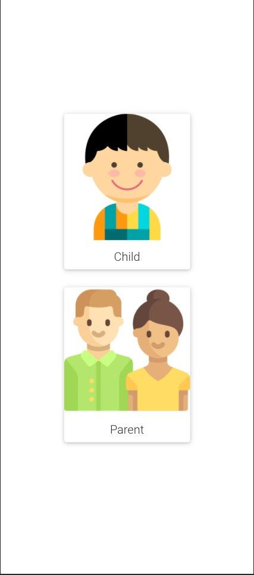
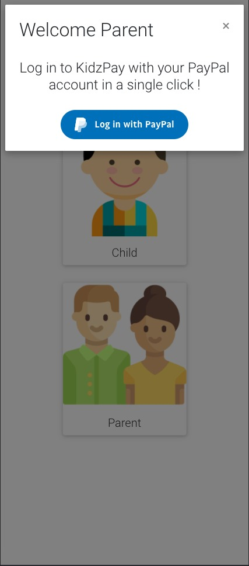
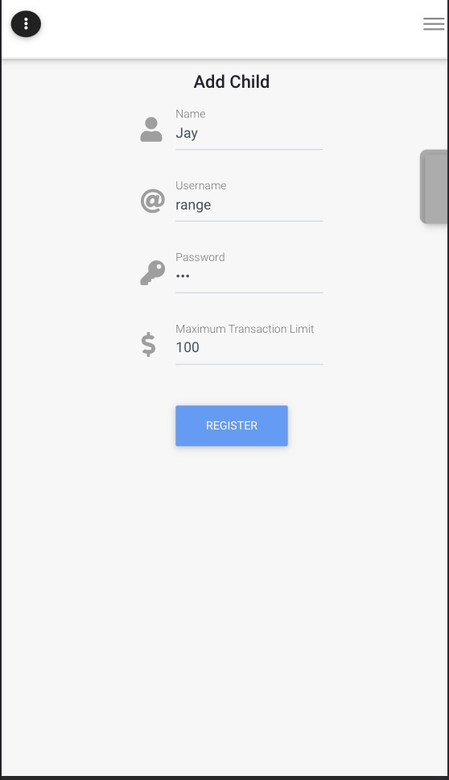
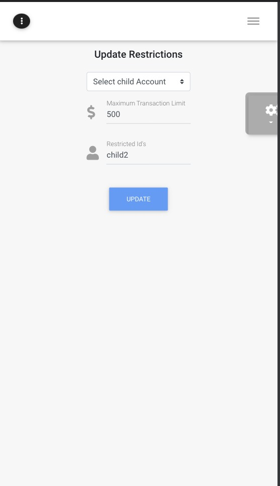
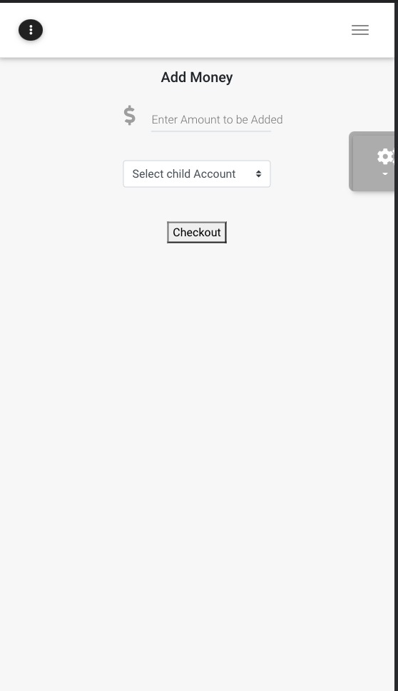
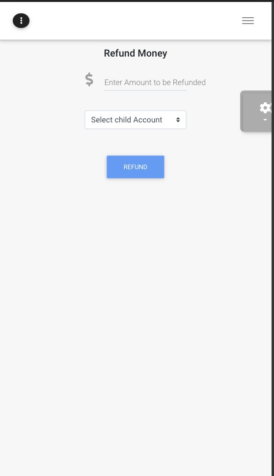

insert image

# KidsPay

Safe Payment App for Kids supporting Prudent parental monitoring. Payment Processing is backed by the PayPal network. The website is built as a responsive PWA (Progressive Web App) and is hosted on Surge.
[kidspay.surge.sh](https://kidspay.surge.sh/)

- See [Frontend](Frontend/) and [Backend](Backend/)

## How it works

- Parent logins into the app using their PayPal account
  
- Creates an account for their child and places restrictions on the account
  
- Restrictions supported are based on Transaction Limit and allowed IDs
- The parent can monitor and update restrictions on their child's account in real time.
  
- The parent is also repsonsible for adding and withdrawing money from their kids account.
  
  
- Each time the Child makes a transaction, the checks placed by the parent are run to decide on allowing or rejecting the transaction.
- We use a central PayPal account as a "Bank". To which the parent deposits money to add to their child's account, using the Checkout API.
- The payments from the child account to other accounts/merhcants are handled using the Payouts api from the "bank" PayPal account to the Merchant or Recipient account.

## Project Structure

the project is structed into [Frontend](Frontend/) and [Backend](Backend/) (More about each part in their respective readmes)

- Backend uses FastAPI, Python, PostgresDB
- Frontend is built using React
